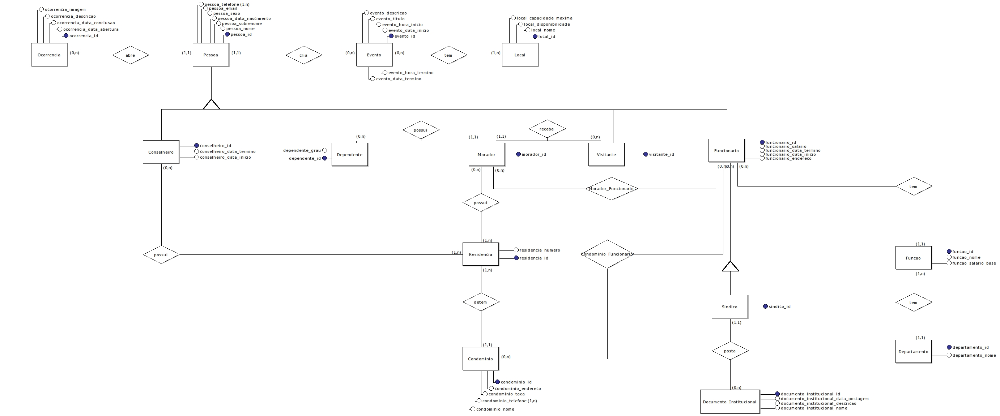

# Modelo Entidade Relacionamento. Modelo Lógico e Modelo Físico

## MER



## Modelo Lógico

Condominio(**condominio_id**, condominio_nome, condominio_endereco, condominio_taxa, condominio_telefone)

Pessoa(**pessoa_id**, pessoa_nome, pessoa_sobrenome, pessoa_data_nascimento, pessoa_sexo, pessoa_email, pessoa_telefone)

Ocorrencia(**ocorrencia_id**, **pessoa_id**, ocorrencia_data_abertura, ocorrencia_data_conclusao, ocorrencia_descricao, ocorrencia_imagem)

* Ocorrencia.pessoa_id REFERENCIA Pessoa.pessoa_id

Local(**local_id**, local_nome, local_disponibilidade, local_capacidade_maxima)

Evento(**evento_id**, pessoa_id, local_id, evento_data_inicio, evento_hora_inicio, evento_titulo, evento_descricao)

* Evento.pessoa_id REFERENCIA Pessoa.pessoa_id
* Evento.local_id REFERENCIA Local.local_id

Residencia(**residencia_id**, residencia_numero, condominio_id)

* Residencia.condominio_id REFERENCIA Condominio.condominio_id

Conselheiro(**conselheiro_id**, residencia_id, conselheiro_data_inicio, conselheiro_data_termino)

* Conselheiro.conselheiro_id REFERENCIA Pessoa.pessoa_id
* Conselheiro.residencia_id REFERENCIA Residencia.residencia_id

Morador(**morador_id**, residencia_id)

* Morador.morador_id REFERENCIA Pessoa.pessoa_id
* Morador.residencia_id REFERENCIA Residencia.residencia_id

Dependente(**dependente_id**, dependente_morador_titular, dependente_grau)

* Dependente.dependente_id REFERENCIA Pessoa.pessoa_id
* Dependente.dependente_morador_titular REFERENCIA Morador.morador_id

Visitante(**visitante_id**, morador_id)

* Visitante.visitante_id REFERENCIA Pessoa.pessoa_id
* Visitante.morador_id REFERENCIA Morador.morador_id

Departamento(**departamento_id**, departamento_nome)

Funcao(**funcao_id**, departamento_id, funcao_nome, funcao_salario_base)

* Funcao.departamento_id REFERENCIA Departamento.departamento_id

Funcionario(**funcionario_id**, funcao_id, funcionario_salario, funcionario_data_inicio, funcionario_data_termino, funcionario_endereco)

* Funcionario.funcionario_id REFERENCIA Pessoa.pessoa_id
* Funcionario.funcao_id REFERENCIA Funcao.funcao_id

Sindico(**sindico_id**, funcionario_id)

* Sindico.sindico_id REFERENCIA Funcionario.funcionario_id

Documento_Institucional(**documento_institucional_id**, documento_institucional_autor, documento_institucional_nome, documento_institucional_data_postagem)

* Documento_Institucional.documento_institucional_autor REFERENCIA Sindico.sindico_id

Condominio_Funcionario(**funcionario_id**, **condominio_id**)

* Condominio_Funcionario.funcionario_id REFERENCIA Funcionario.funcionario_id
* Condominio_Funcionario.condominio_id REFERENCIA Condominio.condominio_id

Morador_Residencia(**morador_id**, **residencia_id**)

* Morador_Residencia.morador_id REFERENCIA Morador.morador_id
* Morador_Residencia.residencia_id REFERENCIA Residencia.residencia_id

Funcionario_Residencia(**funcionario_id**, **residencia_id**)

* Funcionario_Residencia.funcionario_id REFERENCIA Funcionario.funcionario_id
* Funcionario_Residencia.residencia_id REFERENCIA Residencia.residencia_id

## Modelo Físico

### Triggers

```sql
CREATE TRIGGER T_CONDOMINIO ON CONDOMINIO
AFTER UPDATE
AS
BEGIN
  IF (SELECT COUNT() FROM DELETED) <> 0 AND (SELECT COUNT() FROM INSERTED) <> 0

    BEGIN
      PRINT 'TAXA DE CONDOMINIO DEPOIS DA ATUALIZAÇÃO'
      SELECT  condominio_taxa FROM INSERTED
    END

END
```

```sql
CREATE TRIGGER T_PESSOAS  ON PESSOA
FOR UPDATE, INSERT, DELETE
AS
BEGIN
  IF (SELECT COUNT (*) FROM DELETED) <> 0
  BEGIN
    SELECT pessoa_id AS 'ID DA PESSOA EXCLUÍDA', pessoa_nome AS ' NOME DA PESSOA EXCLUÍDA' FROM DELETED;
  END
  IF (SELECT COUNT (*) FROM INSERTED) <> 0
  BEGIN
    SELECT pessoa_id AS 'ID DA PESSOA INSERIDA', pessoa_nome AS 'NOME DA PESSOA INSERIDA' FROM INSERTED;
  END
END
```

### Views

```sql
CREATE VIEW condominio_funcionario_detalhes
(pessoa_nome, pessoa_sobrenome, funcao_nome, funcao_salario)
  AS
      SELECT pessoa_nome, pessoa_sobrenome, funcao_nome, F.funcionario_salario
      FROM teste.dbo.CONDOMINIO_FUNCIONARIO CF
      INNER JOIN teste.dbo.FUNCIONARIO F
          ON CF.funcionario_id = F.funcionario_id
      INNER JOIN teste.dbo.PESSOA P
          ON F.funcionario_id = P.pessoa_id
      INNER JOIN teste.dbo.FUNCAO FC
          ON F.funcao_id = FC.funcao_id;
```

```sql
CREATE VIEW condominio_quantidade_morador_sexo
(sexo, quantidade)
  AS
      SELECT (pessoa_sexo) AS sexo, COUNT(pessoa_sexo) AS quantidade
      FROM teste.dbo.MORADOR M
      INNER JOIN teste.dbo.PESSOA P
        ON M.morador_id = P.pessoa_id
      GROUP BY (pessoa_sexo);
```

### Functions

```sql
Create FUNCTION F_Calcula_Taxa_Condominio(@salario_empregados money, @energia_areas_comuns money, @iptu money, @despesas_extras money, @total_apartamentos int)
RETURNS money
AS
BEGIN
    RETURN (((@salario_empregados + @energia_areas_comuns + @despesas_extras + @iptu) / 12 )/ @total_apartamentos)
END
```

```sql
CREATE FUNCTION  F_OcorrenciaApos (@data date)
RETURNS TABLE
AS
RETURN (SELECT * FROM  dbo.OCORRENCIA WHERE ocorrencia_data_abertura >= @data)
GO
```

### Tabela Condomínio

```sql
CREATE TABLE CONDOMINIO (

  condominio_id INT NOT NULL IDENTITY(1, 1),
  condominio_nome VARCHAR(100),
  condominio_endereco VARCHAR(100) NOT NULL,
  condominio_taxa MONEY NOT NULL,
  condominio_telefone CHAR(10) NOT NULL,
  PRIMARY KEY (condominio_id)
);
```

#### Procedures

##### Cadastrar Condomínio

```sql
CREATE PROCEDURE cadastrar_condominio
@condominio_nome VARCHAR(100) = null,
@condominio_endereço VARCHAR(100) = null,
@condominio_taxa MONEY = null,
@condominio_telefone CHAR(10) = null
AS
BEGIN TRY
  BEGIN TRAN
    INSERT INTO CONDOMINIO(condominio_nome,condominio_endereco,condominio_taxa,condominio_telefone)
    VALUES (@condominio_nome,@condominio_endereço,@condominio_taxa,@condominio_telefone)
    COMMIT TRAN
END TRY
BEGIN CATCH
  ROLLBACK TRAN
END CATCH
```

### Tabela Pessoa

```sql
CREATE TABLE PESSOA(

  pessoa_id CHAR(11) NOT NULL,
  pessoa_nome VARCHAR (50) NOT NULL,
  pessoa_sobrenome VARCHAR (100) NOT NULL,
  pessoa_data_nascimento DATE NOT NULL,
  pessoa_sexo CHAR(1),
  pessoa_email VARCHAR (40) NOT NULL,
  pessoa_telefone CHAR(11),
  PRIMARY KEY (pessoa_id)
);
```

#### Procedures

##### Cadastrar Pessoa

```sql
CREATE PROCEDURE cadastrar_pessoa
@pessoa_id CHAR(11) = null,
@pessoa_nome VARCHAR(50) = null,
@pessoa_sobrenome VARCHAR(100) = null,
@pessoa_data_nascimento DATE = null,
@pessoa_sexo CHAR(1) = null,
@pessoa_email VARCHAR(40) = null,
@pessoa_telefone CHAR(11) = null
AS
BEGIN TRY
  BEGIN TRAN
    INSERT INTO PESSOA (pessoa_id,pessoa_nome,pessoa_sobrenome,pessoa_data_nascimento,pessoa_sexo,pessoa_email,pessoa_telefone)
    VALUES (@pessoa_id,@pessoa_nome,@pessoa_sobrenome,@pessoa_data_nascimento,@pessoa_sexo,@pessoa_email,@pessoa_telefone)
  COMMIT TRAN
END TRY
BEGIN CATCH
  ROLLBACK TRAN
END CATCH
```

### Tabela Ocorrência

```sql
CREATE TABLE OCORRENCIA(

  ocorrencia_id INT NOT NULL IDENTITY(1, 1),
  ocorrencia_data_abertura DATE NOT NULL,
  ocorrencia_data_conclusao DATE,
  ocorrencia_descricao VARCHAR(300) NOT NULL,
  ocorrencia_imagem VARCHAR(100),
  pessoa_id CHAR(11) NOT NULL,
  PRIMARY KEY (ocorrencia_id),
  FOREIGN KEY (pessoa_id) REFERENCES PESSOA (pessoa_id)
);
```

#### Procedures

##### Cadastrar Ocorrência

```sql
CREATE PROCEDURE cadastrar_ocorrencia
@pessoa_id INT = null,
@ocorrencia_data_abertura DATE = null,
@ocorrencia_data_conclusao DATE = null,
@ocorrencia_descricao VARCHAR(300) = null,
@ocorrencia_imagem VARCHAR(100) = NULL
AS
BEGIN TRY
  BEGIN TRAN
    IF @ocorrencia_data_abertura IS NOT NULL
    BEGIN
      INSERT INTO OCORRENCIA(pessoa_id, ocorrencia_data_abertura, ocorrencia_data_conclusao, ocorrencia_descricao, ocorrencia_imagem)
      VALUES(@pessoa_id, @ocorrencia_data_abertura, @ocorrencia_data_conclusao, @ocorrencia_descricao, @ocorrencia_imagem)
    END
    IF @ocorrencia_data_abertura IS NULL
    BEGIN
      DECLARE @data_ocorrencia DATE
      SET @data_ocorrencia = GETDATE()
      INSERT INTO OCORRENCIA(pessoa_id, ocorrencia_data_abertura, ocorrencia_data_conclusao, ocorrencia_descricao, ocorrencia_imagem)
      VALUES(@pessoa_id, @ocorrencia_data_abertura, @ocorrencia_data_conclusao, @ocorrencia_descricao, @ocorrencia_imagem)
    END
  COMMIT TRAN
END TRY
BEGIN CATCH
  ROLLBACK TRAN
END CATCH
```

### Tabela Local

```sql
CREATE TABLE LOCAL(

  local_id INT NOT NULL IDENTITY(1, 1),
  local_nome VARCHAR(100),
  local_disponibilidade TINYINT,
  local_capacidade_maxima INT NOT NULL,
  PRIMARY KEY (local_id)
);
```

#### Procedures

##### Cadastrar Local

```sql
CREATE PROCEDURE cadastrar_local
@local_nome VARCHAR(100) = NULL,
@local_disponibilidade TINYINT = NULL,
@local_capacidade_maxima INT = NULL
AS
BEGIN TRY
  BEGIN TRAN
    INSERT INTO LOCAL(local_nome, local_disponibilidade, local_capacidade_maxima)
    VALUES(@local_nome, @local_disponibilidade, @local_capacidade_maxima)
  COMMIT TRAN
END TRY
BEGIN CATCH
  ROLLBACK TRAN
END CATCH
```

### Tabela Evento

```sql
CREATE TABLE EVENTO (

  evento_id INT NOT NULL  IDENTITY (1, 1),
  evento_data_inicio DATE NOT NULL,
  evento_data_termino DATE NOT NULL,
  evento_hora_inicio TIME NOT NULL,
  evento_hora_termino TIME NOT NULL,
  evento_titulo VARCHAR(100) NOT NULL,
  evento_descricao VARCHAR(300) NOT NULL,
  pessoa_id CHAR(11) NOT NULL,
  local_id INT NOT NULL,
  PRIMARY KEY (evento_id),
  FOREIGN KEY (pessoa_id) REFERENCES PESSOA (pessoa_id),
  FOREIGN KEY (local_id) REFERENCES LOCAL (local_id)
);
```

#### Procedures

##### Cadastrar Evento

```sql
CREATE PROCEDURE cadastrar_evento
@evento_data_inicio DATE = null,
@evento_hora_inicio TIME = null,
@evento_titulo VARCHAR(100) = NULL,
@evento_descricao VARCHAR(300) = NULL,
@local_id INT = NULL,
@pessoa_id INT = NULL
AS
BEGIN TRY
  BEGIN TRAN
    IF @evento_data_inicio IS NOT NULL
    BEGIN
      INSERT INTO EVENTO(pessoa_id, evento_data_inicio, evento_hora_inicio, evento_titulo, evento_descricao, local_id)
      VALUES(@pessoa_id, @evento_data_inicio, @evento_hora_inicio, @evento_titulo, @evento_descricao, @local_id)
    END
    IF @evento_data_inicio IS NULL
    BEGIN
      DECLARE @data_evento DATE
      SET @data_evento = GETDATE()
      INSERT INTO EVENTO(pessoa_id, evento_data_inicio, evento_hora_inicio, evento_titulo, evento_descricao, local_id)
      VALUES(@pessoa_id, @evento_data_inicio, @evento_hora_inicio, @evento_titulo, @evento_descricao, @local_id)
    END
  COMMIT TRAN
END TRY
BEGIN CATCH
  ROLLBACK TRAN
END CATCH
```

### Tabela Residencia

```sql
CREATE TABLE RESIDENCIA(

  residencia_id INT NOT NULL IDENTITY(1, 1),
  residencia_numero VARCHAR(5),
  condominio_id INT NOT NULL,
  PRIMARY KEY (residencia_id),
  FOREIGN KEY (condominio_id) REFERENCES CONDOMINIO (condominio_id)
);
```

#### Procedures

##### Cadastrar Residencia

```sql
CREATE PROCEDURE cadastrar_residencia
@condominio_id INT = null,
@residencia_numero VARCHAR(5) = null
AS
BEGIN TRY
  BEGIN TRAN
    INSERT INTO RESIDENCIA(condominio_id,residencia_numero)
    VALUES (@condominio_id,@residencia_numero)
    COMMIT TRAN
END TRY
BEGIN CATCH
  ROLLBACK TRAN
END CATCH
```

### Tabela Conselheiro

```sql
CREATE TABLE CONSELHEIRO(

  conselheiro_id CHAR(11) NOT NULL,
  conselheiro_data_inicio DATE NOT NULL,
  conselheiro_data_termino DATE NOT NULL,
  residencia_id INT NOT NULL,
  PRIMARY KEY (pessoa_id),
  FOREIGN KEY (pessoa_id) REFERENCES PESSOA (pessoa_id),
  FOREIGN KEY (residencia_id) REFERENCES RESIDENCIA (residencia_id)
);
```

#### Procedures

##### Cadastrar Conselheiro

```sql
CREATE PROCEDURE cadastrar_conselheiro
@pessoa_id CHAR(11) = null,
@conselheiro_data_inicio DATE = null,
@conselheiro_data_termino DATE = null
AS
BEGIN TRY
  BEGIN TRAN
    IF @conselheiro_data_inicio <> NULL
    BEGIN
      INSERT INTO CONSELHEIRO(pessoa_id,conselheiro_data_inicio,conselheiro_data_termino)
      VALUES(@pessoa_id,@conselheiro_data_inicio,@conselheiro_data_termino)
    END
    IF @conselheiro_data_inicio IS NULL
    BEGIN
      DECLARE @sindico_inicio DATE
      SET @sindico_inicio = GETDATE()
      INSERT INTO CONSELHEIRO(pessoa_id,conselheiro_data_inicio,conselheiro_data_termino)
      VALUES(@pessoa_id,@conselheiro_data_inicio,@conselheiro_data_termino)
    END
  COMMIT TRAN
END TRY
BEGIN CATCH
  ROLLBACK TRAN
END CATCH
```

### Tabela Morador

```sql
CREATE TABLE MORADOR(

  morador_ir CHAR(11) NOT NULL,
  residencia_id INT NOT NULL
  PRIMARY KEY (morador_id),
  FOREIGN KEY (morador_id) REFERENCES PESSOA (pessoa_id),
  FOREIGN KEY (residencia_id) REFERENCES RESIDENCIA (residencia_id)
);
```

#### Procedures

##### Cadastrar Morador

```sql
CREATE PROCEDURE cadastrar_morador
@morador_id CHAR(11) = null,
@residencia_id INT = null
AS
BEGIN TRY
  BEGIN TRAN
    INSERT INTO MORADOR(morador_id,residencia_id)
    VALUES (@morador_id,@residencia_id)
    COMMIT TRAN
END TRY
BEGIN CATCH
  ROLLBACK TRAN
END CATCH
```

### Tabela Dependente

```sql
CREATE TABLE DEPENDENTE(

  dependente_id CHAR(11) NOT NULL,
  dependente_grau VARCHAR(30),
  dependente_morador_titular CHAR(11) NOT NULL,
  PRIMARY KEY (dependente_id),
  FOREIGN KEY (dependente_id) REFERENCES PESSOA (pessoa_id),
  FOREIGN KEY (dependente_morador_titular) REFERENCES MORADOR (morador_id)
);
```

#### Procedures

##### Cadastrar Dependente

```sql
CREATE PROCEDURE cadastrar_dependente
@dependente_id CHAR(11) = null,
@dependente_grau VARCHAR(30) = null,
@dependente_morador_titular CHAR(11) = null
AS
BEGIN TRY
  BEGIN TRAN
    INSERT INTO DEPENDENTE(dependente_id, dependente_grau, dependente_morador_titular)
    VALUES (@dependente_id,@dependente_grau,@dependente_morador_titular)
    COMMIT TRAN
END TRY
BEGIN CATCH
  ROLLBACK TRAN
END CATCH
```

### Tabela Visitante

```sql
CREATE TABLE VISITANTE(

  visitante_id CHAR(11) NOT NULL,
  PRIMARY KEY (visitante_id),
  FOREIGN KEY (visitante_id) REFERENCES PESSOA (pessoa_id)
);
```

#### Procedures

##### Cadastrar Visitante

```sql
CREATE PROCEDURE cadastrar_visitante
@pessoa_id CHAR(11) = null
AS
BEGIN TRY
  BEGIN TRAN
    INSERT INTO VISITANTE(pessoa_id)
    VALUES (@pessoa_id)
    COMMIT TRAN
END TRY
BEGIN CATCH
  ROLLBACK TRAN
END CATCH
```

### Tabela Departamento

```sql
CREATE TABLE DEPARTAMENTO(

  departamento_id INT NOT NULL IDENTITY(1, 1),
  departamento_nome VARCHAR(100),
  PRIMARY KEY (departamento_id)
);
```

#### Procedures

##### Cadastrar Departamento

```sql
CREATE PROCEDURE cadastrar_departamento
@departamento_nome VARCHAR(100) = null
AS
BEGIN TRY
  BEGIN TRAN
    INSERT INTO DEPARTAMENTO(departamento_nome)
    VALUES (@departamento_nome)
    COMMIT TRAN
END TRY
BEGIN CATCH
  ROLLBACK TRAN
END CATCH
```

### Tabela Função

```sql
CREATE TABLE FUNCAO(

  funcao_id INT NOT NULL IDENTITY(1, 1),
  funcao_nome VARCHAR(20),
  funcao_salario_base MONEY NOT NULL,
  departamento_id INT NOT NULL,
  PRIMARY KEY (funcao_id),
  FOREIGN KEY (departamento_id) REFERENCES DEPARTAMENTO (departamento_id)
);
```

#### Procedures

##### Cadastrar Função

```sql
CREATE PROCEDURE cadastrar_funcao
@funcao_nome VARCHAR(20) = null,
@funcao_salario_base MONEY = null,
@departamento_id INT = null
AS
BEGIN TRY
  BEGIN TRAN
    INSERT INTO FUNCAO(funcao_nome, funcao_salario_base, departamento_id)
    VALUES (@funcao_nome, @funcao_salario_base, @departamento_id)
    COMMIT TRAN
END TRY
BEGIN CATCH
  ROLLBACK TRAN
END CATCH
```

### Tabela Funcionário

```sql
CREATE TABLE FUNCIONARIO(

  funcionario_id CHAR(11) NOT NULL,
  funcionario_salario MONEY NOT NULL,
  funcionario_data_inicio DATE NOT NULL,
  funcionario_data_termino DATE,
  funcionario_endereco VARCHAR(100) NOT NULL,
  funcao_id INT NOT NULL,
  PRIMARY KEY (funcionario_id),
  FOREIGN KEY (funcionario_id) REFERENCES PESSOA (pessoa_id),
  FOREIGN KEY (funcao_id) REFERENCES FUNCAO (funcao_id),
);
```

#### Procedures

##### Cadastrar Funcionário

```sql
CREATE PROCEDURE cadastrar_funcionario
@funcionario_id CHAR(11) = null,
@funcionario_salario MONEY = null,
@funcionario_data_inicio DATE = NULL,
@funcionario_endereco VARCHAR(100) = NULL,
@funcao_id INT = null
AS
BEGIN TRY
  BEGIN TRAN
    INSERT INTO FUNCIONARIO(funcionario_id, funcionario_salario, funcionario_data_inicio, funcionario_endereco, funcao_id)
    VALUES (@funcionario_id, @funcionario_salario, @funcionario_data_inicio, @funcionario_endereco, @funcao_id)
    COMMIT TRAN
END TRY
BEGIN CATCH
  ROLLBACK TRAN
END CATCH
```

### Tabela Síndico

```sql
CREATE TABLE SINDICO(

  sindico_id CHAR(11) NOT NULL,
  PRIMARY KEY (sindico_id),
  FOREIGN KEY (sindico_id) REFERENCES FUNCIONARIO (funcionario_id)
);
```

#### Procedures

##### Cadastrar Síndico

```sql
CREATE PROCEDURE cadastrar_sindico
@sindico_id CHAR(11) = null
AS
BEGIN TRY
  BEGIN TRAN
    INSERT INTO SINDICO(sindico_id)
    VALUES(@sindico_id)
    COMMIT TRAN
END TRY
BEGIN CATCH
  ROLLBACK TRAN
END CATCH
```

### Tabela Documento Institucional

```sql
CREATE TABLE DOCUMENTO_INSTITUCIONAL(

  documento_institucional_id INT NOT NULL IDENTITY(1, 1),
  documento_institucional_nome VARCHAR(50) NOT NULL,
  documento_institucional_data_postagem DATE NOT NULL,
  documento_institucional_autor CHAR(11) NOT NULL,
  PRIMARY KEY (documento_institucional_id),
  FOREIGN KEY (documento_institucional_autor) REFERENCES SINDICO (sindico_id)
);
```

#### Procedures

##### Cadastrar Documento Institucional

```sql
CREATE PROCEDURE cadastrar_documento_institucional
@documento_institucional_nome VARCHAR(50) = null,
@documento_institucional_data_postagem DATE = null,
@documento_institucional_autor VARCHAR(11) = null
AS
BEGIN TRY
  BEGIN TRAN
    INSERT INTO DOCUMENTO_INSTITUCIONAL(documento_institucional_nome, documento_institucional_data_postagem,documento_institucional_autor)
    VALUES(@documento_institucional_nome, @documento_institucional_data_postagem, @documento_institucional_autor)
  COMMIT TRAN
END TRY
BEGIN CATCH
  ROLLBACK TRAN
END CATCH
```

### Tabela Condomínio Funcionário

```sql
CREATE TABLE CONDOMINIO_FUNCIONARIO(

  funcionario_id CHAR(11) NOT NULL,
  condominio_id INT NOT NULL,
  PRIMARY KEY (funcionario_id, condominio_id),
  FOREIGN KEY (funcionario_id) REFERENCES FUNCIONARIO (funcionario_id),
  FOREIGN KEY (condominio_id) REFERENCES CONDOMINIO (condominio_id)
);
```

### Tabela Morador Residência

```sql
CREATE TABLE MORADOR_RESIDENCIA(

  morador_id CHAR(11) NOT NULL,
  residencia_id INT NOT NULL,
  PRIMARY KEY (morador_id, residencia_id),
  FOREIGN KEY (morador_id) REFERENCES MORADOR (morador_id),
  FOREIGN KEY (residencia_id) REFERENCES RESIDENCIA (residencia_id)
);
```